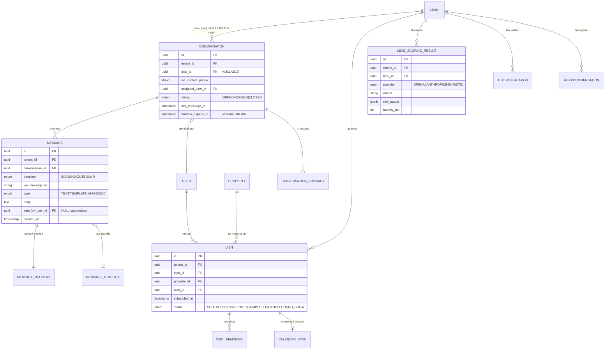
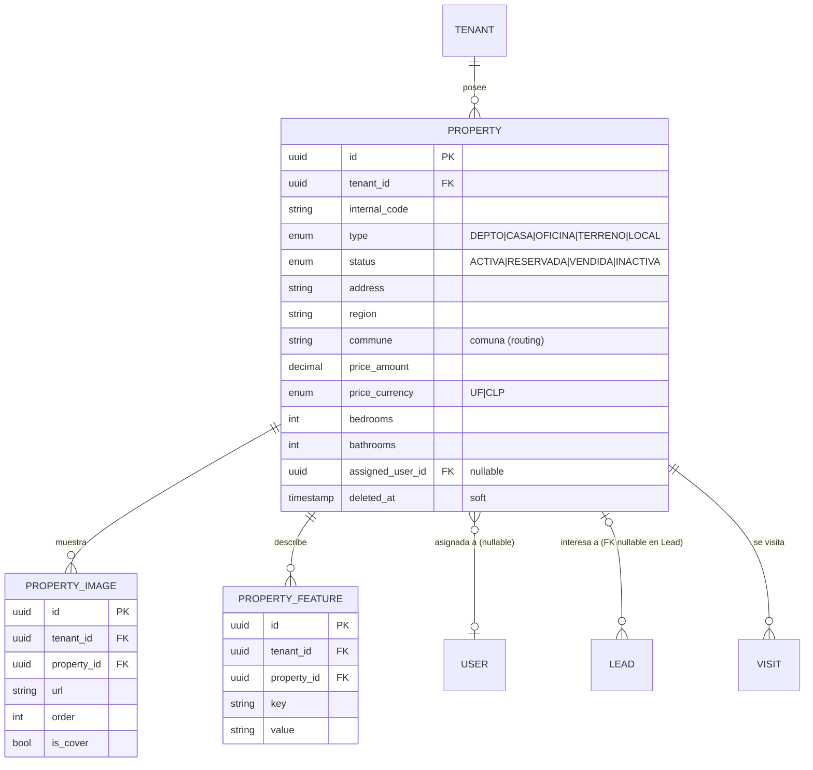
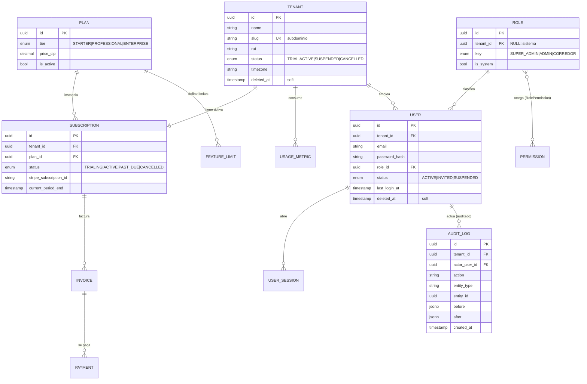

# FASE 7 — Diagrama Entidad-Relación (ERD)

> Documento visual para **CLIENTRA**. Parte 7 de 13.
> Representación gráfica del modelo lógico de la FASE 6.
> **Tesis visual:** todo el sistema **orbita al `Lead`**. `Property` es un **satélite de soporte**, no el centro.
> Los diagramas Mermaid se renderizan automáticamente en GitHub.

---

## 1. Vista conceptual radial — el Lead como centro gravitacional

```
                          ┌──────────────────┐
                          │   AI DOMAIN       │
                          │ Scoring·Classify  │
                          │ Summary·Recommend │
                          └────────┬─────────┘
                                   │ (alimenta priorización)
                                   ▼
        ┌────────────────┐   ┌──────────┐   ┌──────────────────┐
        │  WHATSAPP       │   │          │   │  FOLLOW-UP /      │
        │  Conversation   │◀─▶│          │◀─▶│  RECOVERY         │
        │  Message        │   │          │   │  LeadFollowUp     │
        └────────────────┘   │          │   │  LeadRecovery     │
                              │  ★ LEAD ★ │   └──────────────────┘
        ┌────────────────┐   │          │   ┌──────────────────┐
        │  ASSIGNMENT     │◀─▶│ (núcleo) │◀─▶│  ACTIVITY /       │
        │  LeadAssignment │   │          │   │  TIMELINE         │
        │  → User/Corredor│   │          │   │  LeadActivity·Note│
        └────────────────┘   │          │   └──────────────────┘
                              │          │
        ┌────────────────┐   │          │   ┌──────────────────┐
        │  SCORE          │◀─▶│          │◀─▶│  VISIT            │
        │  LeadScore      │   └────┬─────┘   │  Visit·Reminder   │
        │  (HOT/WARM/COLD)│        │         └──────────────────┘
        └────────────────┘        │
                                   ▼ (interested_property_id, NULLABLE)
                          ┌──────────────────┐
                          │  PROPERTY         │  ←── SATÉLITE DE SOPORTE
                          │  (dato de apoyo,  │      (no es el centro;
                          │   relación opcional)│     el Lead existe sin ella)
                          └──────────────────┘

        ┌─────────────────────────────────────────────────────────┐
        │  TENANT (envuelve TODO) · USER (corredores) · BILLING    │
        │  capa de plataforma — contiene al Lead, no compite con él │
        └─────────────────────────────────────────────────────────┘
```

**Lectura del diagrama:** las 7 entidades satélite críticas (Score, Assignment, Activity, Follow-Up, Recovery, WhatsApp, Visit) existen **para servir al Lead** en su camino a la conversión. `Property` cuelga del Lead por una FK **nullable** (`interested_property_id`): un lead puede entrar sin propiedad asociada y aun así ser capturado, calificado y trabajado. **Esa nulabilidad es la prueba estructural de que Property no es el centro.**

---

## 2. ERD — Núcleo Lead (CORE DOMAIN)

```mermaid
erDiagram
    LEAD ||--o{ LEAD_SCORE : "tiene histórico"
    LEAD ||--o{ LEAD_ASSIGNMENT : "fue asignado"
    LEAD ||--o{ LEAD_ACTIVITY : "registra"
    LEAD ||--o{ LEAD_NOTE : "anota"
    LEAD ||--o{ LEAD_FOLLOWUP : "programa cadencia"
    LEAD ||--o{ LEAD_RECOVERY : "intenta recuperar"
    LEAD }o--o{ LEAD_TAG : "etiqueta (via LeadTagLink)"
    LEAD ||--o{ CONVERSATION : "centraliza chats"
    LEAD ||--o{ VISIT : "agenda"
    LEAD }o--|| USER : "asignado a (corredor)"
    LEAD }o--o| PROPERTY : "interesado en (NULLABLE)"

    LEAD {
        uuid id PK
        uuid tenant_id FK "aísla"
        string first_name
        string last_name
        string email "dedup"
        string phone "dedup / WhatsApp"
        enum source "WHATSAPP|META_ADS|LANDING|..."
        enum status "NUEVO→...→VENTA_CERRADA|PERDIDO"
        enum lost_reason "nullable"
        decimal budget_amount
        decimal down_payment "pie"
        enum credit_status "PRE_APPROVED|APPROVED"
        bool subsidy_eligible "diferenciador CL"
        enum urgency
        uuid assigned_user_id FK
        enum current_score_tier "HOT|WARM|COLD desnorm."
        timestamp first_response_at "★ speed-to-lead"
        timestamp last_activity_at "★ recovery"
        uuid interested_property_id FK "NULLABLE"
        jsonb raw_payload
        timestamp deleted_at "soft delete"
    }

    LEAD_SCORE {
        uuid id PK
        uuid tenant_id FK
        uuid lead_id FK
        int score_value "0-100"
        enum tier "HOT|WARM|COLD"
        jsonb reasons
        enum source "AI|HEURISTIC"
        timestamp scored_at
    }

    LEAD_ASSIGNMENT {
        uuid id PK
        uuid tenant_id FK
        uuid lead_id FK
        uuid user_id FK
        enum assigned_by "SYSTEM|MANUAL"
        jsonb reason "comuna|carga"
        timestamp assigned_at
        timestamp unassigned_at "nullable"
    }

    LEAD_FOLLOWUP {
        uuid id PK
        uuid tenant_id FK
        uuid lead_id FK
        int sequence_step "día 1|3|7|14"
        enum channel "WHATSAPP|EMAIL"
        timestamp scheduled_at
        timestamp executed_at "nullable"
        enum status "PENDING|SENT|CANCELLED|FAILED"
        enum cancel_reason "LEAD_ADVANCED..."
    }

    LEAD_RECOVERY {
        uuid id PK
        uuid tenant_id FK
        uuid lead_id FK
        enum inactivity_threshold "DAYS_30|60|90"
        timestamp detected_at
        jsonb recovery_action
        enum outcome "PENDING|REACTIVATED|NO_RESPONSE|LOST"
        timestamp resolved_at "nullable"
    }

    LEAD_ACTIVITY {
        uuid id PK
        uuid tenant_id FK
        uuid lead_id FK
        uuid user_id FK "autor"
        enum type "LLAMADA|WHATSAPP|EMAIL|VISITA|NOTA|STATUS_CHANGE"
        string summary
        jsonb metadata
        timestamp occurred_at
    }

    LEAD_NOTE {
        uuid id PK
        uuid tenant_id FK
        uuid lead_id FK
        uuid user_id FK
        text body
        timestamp deleted_at "soft"
    }

    LEAD_TAG {
        uuid id PK
        uuid tenant_id FK
        string name
        string color
    }
```



---

## 3. ERD — WhatsApp + Visit + AI (satélites de conversión)



> **Nota de diseño visible en el ERD:** `CONVERSATION.lead_id` es **NULLABLE** — un mensaje de WhatsApp puede llegar **antes** de que exista el Lead. El Intake crea el Lead y vincula la conversación después. Esto materializa "no perder ningún lead".

---

## 4. ERD — Property como SOPORTE (deliberadamente periférico)



> **Por qué Property es soporte y no centro (evidencia estructural):**
> 1. La relación Lead→Property es **opcional** (`interested_property_id` NULLABLE).
> 2. Si se borra una propiedad, el Lead **sobrevive** (`SET NULL`), nunca cascadea.
> 3. Property **no tiene** score, ni cadencia, ni recovery, ni timeline de conversión — esas capacidades son exclusivas del Lead.
> 4. El MVP excluye MLS, canje, publicación y marketplace: Property es un CRUD de apoyo, no un motor.

---

## 5. ERD — Plataforma: Tenant, Auth, Billing (envuelven el dominio)



> **La plataforma contiene al dominio, no compite con él:** `Tenant` envuelve cada entidad vía `tenant_id`; `User` provee los corredores a los que el Lead se asigna; Billing gobierna el acceso. Ninguna de estas entidades disputa la centralidad del Lead — lo **habilitan**.

---

## 6. Mapa completo de cardinalidades

| Relación | Cardinalidad | Notación Mermaid | Ownership |
|----------|:------------:|:----------------:|-----------|
| Tenant → Lead | 1 : N | `\|\|--o{` | Tenant posee |
| **Lead → LeadScore** | 1 : N | `\|\|--o{` | Lead posee (histórico) |
| **Lead → LeadAssignment** | 1 : N | `\|\|--o{` | Lead posee (histórico) |
| **Lead → LeadActivity** | 1 : N | `\|\|--o{` | Lead posee (append-only) |
| **Lead → LeadNote** | 1 : N | `\|\|--o{` | Lead posee |
| **Lead → LeadFollowUp** | 1 : N | `\|\|--o{` | Lead posee |
| **Lead → LeadRecovery** | 1 : N | `\|\|--o{` | Lead posee |
| **Lead ↔ LeadTag** | N : N | `}o--o{` | join LeadTagLink |
| **Lead → Conversation** | 1 : N | `\|\|--o{` | Lead posee (lead_id nullable) |
| **Lead → Visit** | 1 : N | `\|\|--o{` | Lead posee |
| Lead → User (assigned) | N : 1 | `}o--\|\|` | User referenciado |
| **Lead → Property (interested)** | **N : 0..1** | `}o--o\|` | **opcional — Property NO es dueña** |
| Conversation → Message | 1 : N | `\|\|--o{` | Conversation posee |
| Message → MessageDelivery | 1 : 1 | `\|\|--\|\|` | Message posee |
| Property → PropertyImage | 1 : N | `\|\|--o{` | Property posee |
| Property → Visit | 1 : N | `\|\|--o{` | Property referenciada |
| Visit → VisitReminder | 1 : N | `\|\|--o{` | Visit posee |
| Visit → CalendarSync | 1 : 0..1 | `\|\|--o\|` | Visit posee |
| Tenant → Subscription | 1 : 1 | `\|\|--\|\|` | Tenant posee |
| Plan → Subscription | 1 : N | `\|\|--o{` | Plan referenciado |
| Subscription → Invoice | 1 : N | `\|\|--o{` | Subscription posee |
| Invoice → Payment | 1 : N | `\|\|--o{` | Invoice posee |
| Tenant → User | 1 : N | `\|\|--o{` | Tenant posee |
| Role ↔ Permission | N : N | `}o--o{` | join RolePermission |
| User → UserSession | 1 : N | `\|\|--o{` | User posee |
| Lead → AI tables | 1 : N | `\|\|--o{` | Lead referenciado |

---

## 7. Leyenda de notación (Crow's Foot / Mermaid)

```
  ||--||   uno y solo uno  ──  uno y solo uno     (1:1)
  ||--o{   uno y solo uno  ──  cero o muchos      (1:N)
  }o--||   cero o muchos   ──  uno y solo uno     (N:1)
  }o--o{   cero o muchos   ──  cero o muchos      (N:N, requiere join)
  }o--o|   cero o muchos   ──  cero o uno         (N:0..1, relación OPCIONAL)

  PK = Primary Key   FK = Foreign Key   UK = Unique Key
  ★  = campo estratégico para conversión
```

---

## 8. Lectura final del ERD: la jerarquía gravitacional

```
   NIVEL 0 (plataforma)   TENANT  ──  envuelve absolutamente todo (tenant_id)
                             │
   NIVEL 1 (★ NÚCLEO ★)     LEAD  ──  la entidad con más relaciones del sistema (11 satélites)
                          ╱  │  ╲
   NIVEL 2 (satélites de   Score Assignment Activity FollowUp Recovery
            conversión)    Conversation/Message  Visit  AI-results
                             │
   NIVEL 3 (soporte)      PROPERTY  ──  colgada por FK nullable; CRUD de apoyo
                          USER      ──  provee corredores al Lead
                          BILLING   ──  gobierna el acceso
```

**Métrica que lo prueba:** el `Lead` participa en **11 relaciones** (el doble que cualquier otra entidad). `Property` participa en 4, todas de soporte y ninguna que controle el ciclo de conversión. **El ERD es, estructuralmente, lead-céntrico** — exactamente la tesis de producto de CLIENTRA.

---

### Estado de la fase
✅ **FASE 7 completada.** Próxima: **FASE 8 — Prisma Schema** (traducción de este modelo lógico a un `schema.prisma` profesional: modelos, enums, relaciones, índices, `@@map`, estrategia de migraciones y la extensión multi-tenant).
